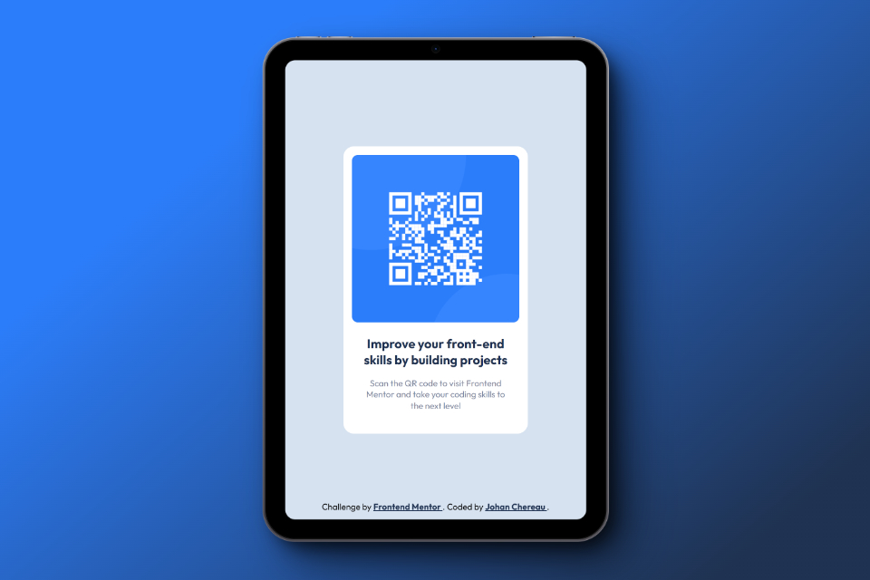
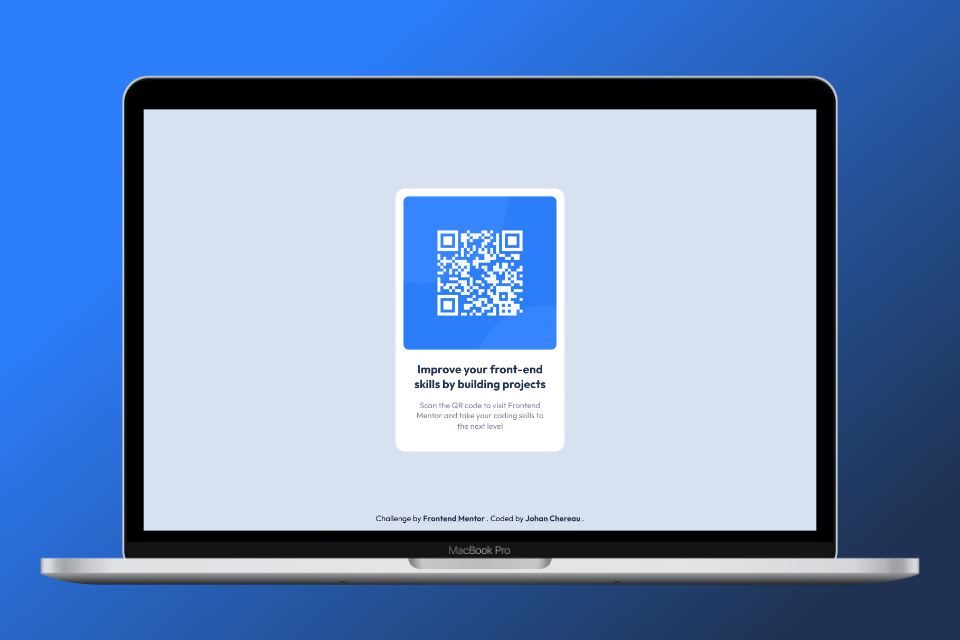

# Frontend Mentor - QR code component solution

This is a solution to the [QR code component challenge on Frontend Mentor](https://www.frontendmentor.io/challenges/qr-code-component-iux_sIO_H). Frontend Mentor challenges help you improve your coding skills by building realistic projects. 

## Table of contents

- [Overview](#overview)
  - [Screenshots](#screenshots)
  - [Links](#links)
- [My process](#my-process)
  - [Built with](#built-with)
  - [Useful resources](#useful-resources)
- [Author](#author)

## Overview

### Screenshots

#### Mobile view:

#### Tablet view:

#### Laptop view:

### Links

- My solution on Front End Mentor: [Front end mentor solution URL](https://your-solution-url.com)
- Live Site URL: [Live site URL](https://johanchereau.github.io/qr-code-component-main/)

## My process
For this challenge, I didn't use any frameworks, just vanilla HTML and CSS. I've tried to respect HTML semantics as much as possible, and to produce clean, readable code that respects best practices. In particular, I used BEM notation and custom CSS properties.

### Built with

- Semantic HTML5 markup
- CSS custom properties
- CSS Grid
- Mobile-first workflow
- BEM (Block, Element, Modifer)

### Useful resources

- [CSS-Tricks](https://css-tricks.com/snippets/css/complete-guide-grid/) - Guide to all CSS grid properties, with examples.

## Author
- Frontend Mentor - [@JohanChereau](https://www.frontendmentor.io/profile/JohanChereau)

